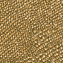
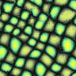
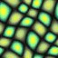

# TP de statistiques pour l'image

## Génération de textures procédurale

- Etirement et génération de variation de textures (marche mieux avec du stochastique ou du near stochatique) via Efros Leung.
- Accélération de l'algorithme via une bounding box pour vérifier les pixels a traiter
- Utilisation d'OpenCV pour charger les images dans des tableaux.
- Utilisation d'OpenMP pour paralléliser certaines parties.

Il y a deux variables importantes pour cette algo, Epsilon et la taille de patch a checker.
- Epsilon : Distance max au patch le plus similaire qu'on accepte dans l'algorithme, plus c'est bas, plus c'est fidèle mais moins on verra émerger de nouveaux patternes.
- Taille de patch : Taille des patch a échantillonner dans la texture d'origine pour générer la texture, plus c'est haut plus on va choper de grand patternes mais on risque d'être trop "précis"  pour des textures stochastique (aléatoire, sans répétitions)

   
Textures générés via les patrons suivants  
   
Elles sont générée avec une taille de patch de 9, et un epsilon de 0.1

## Entrainement d'un classifieur KMEAN

- Implémentation d'un KMean générique à N dimensions
- Entrainement sur les données de  découpée en patch avec des gradients d'histogramme.
- ça reste un kmean, on est a 50% d'accuracy, c'est pas si mal mais en fonction de la ou on est sur le patch etc, les textures ont d'énorme variation, et ça devient soit dur d'avoir assez de patch si on augmente la taille des patchs, soit dur d'avoir tout les patterns d'une texture.

(Conclusion faudrait implementer un meilleur classifieur, mais pas le but/ le temps dans le cadre de ce tp) 
